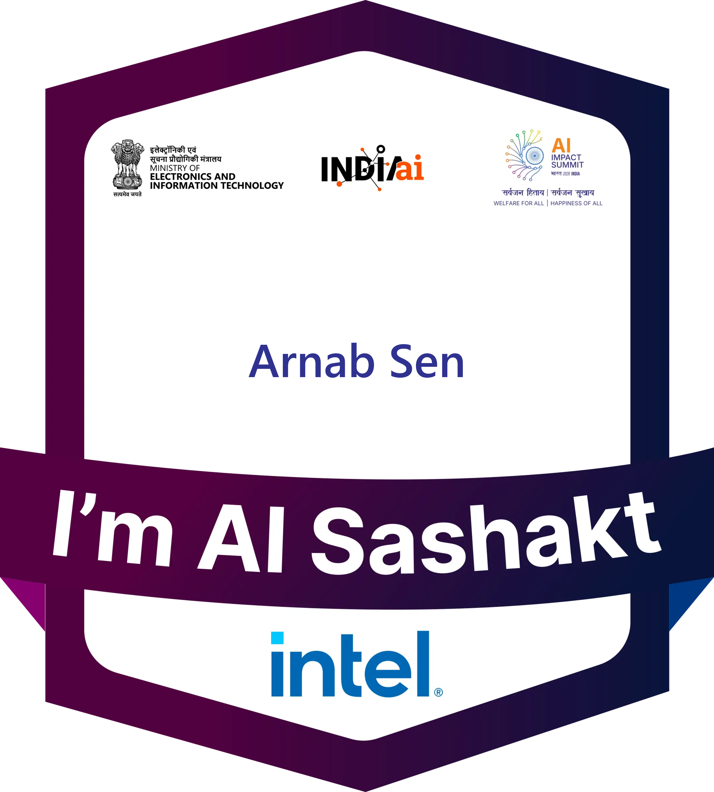

# Future Skills Prime - Digital Badges Portfolio

A professional portfolio website showcasing digital badges earned through Future Skills Prime platform.

## 🏆 Featured Badges

This portfolio displays 9 professional certifications across various technology domains:

- **Product Management** - IPL certification and key responsibilities
- **Cloud Computing** - Google Cloud Generative AI and foundational cloud skills
- **IoT & Emerging Tech** - Cisco IoT introduction and drone technology
- **Artificial Intelligence** - Future of AI insights
- **Web & Mobile Development** - Industry trends and applications

## 🚀 Features

- **Responsive Design** - Works perfectly on desktop, tablet, and mobile devices
- **Modern UI/UX** - Clean, professional design with smooth animations
- **Interactive Elements** - Hover effects and smooth transitions
- **Direct Badge Links** - Click to view official badge credentials
- **Performance Optimized** - Fast loading with optimized assets

## 🛠️ Technologies Used

- **HTML5** - Semantic markup structure
- **CSS3** - Modern styling with Flexbox/Grid, animations, and responsive design
- **JavaScript** - Interactive features and smooth animations
- **Font Awesome** - Professional icons
- **Google Fonts** - Inter font family for clean typography

## 📱 Responsive Design

The portfolio is fully responsive and optimized for:
- Desktop computers (1200px+)
- Tablets (768px - 1199px)
- Mobile phones (320px - 767px)

## 🎨 Design Features

- **Glass morphism effects** with backdrop blur
- **Gradient backgrounds** for visual appeal
- **Card-based layout** for easy scanning
- **Smooth animations** on scroll and hover
- **Professional color scheme** with accessibility in mind

## 🔗 Links

- [Future Skills Prime Profile](https://www.futureskillsprime.in/iDH/fsp/user/rich-profile/in)
- Individual badge verification links included in each card

## 📄 License

This project is open source and available under the [MIT License](LICENSE).

## 🤝 Contributing

Feel free to fork this project and customize it for your own badge portfolio!

---

**Built with ❤️ to showcase professional development achievements**